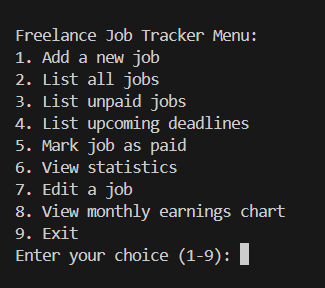

# Freelance Job Tracker (Python CLI App)

A command-line application to help freelancers manage job applications, payments, deadlines, and income statistics. Built in Python with CSV-based storage and simple data visualization.


## 🔑 Main Features
- Add and manage freelance jobs  
- Track deadlines and payment status  
- View total and monthly earnings  
- Generate earnings charts  
- Store all data in a CSV file  


## 🧩 Feature Breakdown

### Job Entry
- Add a new job with client name, project name, deadline, and payment  
- Each job is saved to a CSV file  

### Payment Tracking
- Mark jobs as paid or unpaid  
- Track total earnings to date  

### Statistics & Visualization
- See a breakdown of monthly income  
- Generates an earnings bar chart using matplotlib  


## 🛠 Tech Stack
- Python  
- pandas  
- matplotlib  
- CSV File I/O  
- Command-line Interface (CLI)


## 📁 How to Run

1. Clone the repository
```bash
git clone https://github.com/husnainjatoi/freelance-job-tracker
```
3. Navigate to the project folder
```bash
cd freelance-job-tracker
```
3. Install dependencies
If you're using the included requirements.txt:
```bash
pip install -r requirements.txt
```
4. Run the application
```bash
python freelance_tracker.py
```

## 🖼️ Screenshots

<p align="center">
  
  <br><br>
  
  <br><br>
  
</p>


## 📌 Notes
This project was built to practice data handling, CLI design, and simple analytics in Python. It helps freelancers keep track of work and earnings in a practical, personal workflow.
